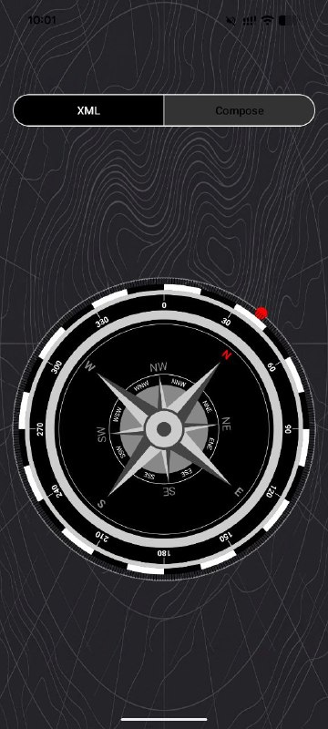

# CanvaCompass

CanvaCompass is a demo Android application showcasing how to implement a compass UI using **Canvas** API in both traditional **XML Views** and modern **Jetpack Compose**.

## Features
- **Dual UI Implementation:** 
  - Traditional `CompassView` (extending `View`).
  - Modern `CompassScreen` (using `Jetpack Compose`).
- **Sensor Integration:** Uses `Rotation Vector Sensor` for high precision or a combination of Accelerometer and Magnetometer as a fallback.
- **Orientation Support:** Automatically adjusts azimuth calculation based on screen rotation (Portrait/Landscape).
- **Smooth Animations:** Fluid needle rotation using `ValueAnimator` (View) and `animateFloatAsState` (Compose).

## Screenshot

## Azimuth Calculation Algorithm
The app determines the heading using the following logic:

1. **Sensor Data Collection:** The app prioritizes `Sensor.TYPE_ROTATION_VECTOR`. If unavailable, it falls back to `Sensor.TYPE_ACCELEROMETER` and `Sensor.TYPE_MAGNETIC_FIELD`.
2. **Rotation Matrix:** A rotation matrix is calculated using `SensorManager.getRotationMatrix` (or from the rotation vector) to determine device orientation relative to the Earth.
3. **Coordinate Remapping:** To ensure the compass works correctly in landscape mode, the coordinate system is remapped using `SensorManager.remapCoordinateSystem` based on the current display rotation (`Surface.ROTATION_X`).
4. **Orientation Angles:** `SensorManager.getOrientation` converts the matrix into orientation angles (azimuth, pitch, and roll).
5. **Normalization:** The azimuth value is converted from radians to degrees and normalized to a [0, 360) range.

## Tags
`#Android` `#Kotlin` `#JetpackCompose` `#Canvas` `#CustomView` `#Compass` `#Sensors` `#RotationVector` `#Magnetometer` `#UI` `#MobileDevelopment`

---
**P.S.** A performance metrics comparison between the View and Compose implementations is planned to be added later.
